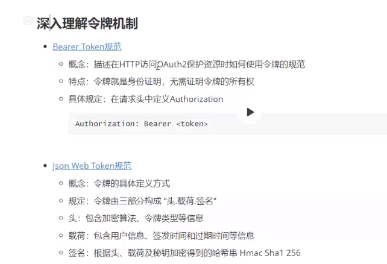

# 笔记

- 准备工作
- devServer mock数据
- http拦截器
  - 请求拦截器
  - 响应拦截器
- 令牌机制
- devServer设置代理.

# devServer mock数据
```
configureWebpack: {
    devServer: {
      before(app) {
        app.get("/api/login", function (req, res) {
          const { username, passwd } = req.query;
          console.log(username, passwd);

          if (username == "kaikeba" && passwd == "123") {
            res.json({ code: 1, token: "jilei" });
          } else {
            res
              .status(401)
              .json({ code: 0, message: "用户名或者密码错误" });
          }
        });
      }
    }
  }
```

# http拦截器
```
// interceptor.js
const axios = require("axios");
export default function () {
  axios.interceptors.request.use(config => {
    const token = localStorage.getItem('token')
    if (token) {
      config.headers.token = token;
    }
    return config;
  });

  // 响应拦截
  axios.interceptors.response.use(null, err => {
    if (err.response.status === 401) {
        // 清空vuex和localstorage
        vm.$store.dispatch("logout");
        // 跳转login
        vm.$router.push("/login");
      }
      return Promise.reject(err);
    });
  }
}
// 启用，main.js
import interceptor from './interceptor'
interceptor();
```
# 令牌机制
```
const Koa = require("koa");
const Router = require("koa-router");

// 用于签发token
const jwt = require("jsonwebtoken");

// 用于验证token.
const jwtAuth = require("koa-jwt");

// 密钥
const secret = "it's a secret";

const app = new Koa();
const router = new Router();

router.get('/api/login', async ctx => {
  const { username, password } = ctx.query;
  if (username === 'jack' && password === '111111') {
    // 签发token.
    const token = jwt.sign({
      data: { name: username },

      // 过期时间
      exp: Math.floor(Date.now() / 1000) + 60 * 60
    },

      // 使用的密钥.
      secret
    );

    ctx.body = {
      code: 200,
      token
    }
  } else {
    ctx.status = 401;
    ctx.body = {
      code: 1,
      message: '用户名和密码错误'
    }
  }
});

router.get(
  '/api/getUserInfo',

  // 验证token是否有效
  jwtAuth({ secret }),
  async ctx => {
    ctx.body = {
      code: 200,
      name: 'jack'
    }
  });

app.use(router.routes());
app.listen(3000);
```
# 代理配置
```
configureWebpack: {
    devServer: {
      proxy: {
        '/api': {
          target: 'http://localhost:3000/',
          changeOrigin: true
        }
      }
  }
}
```
# 其他


