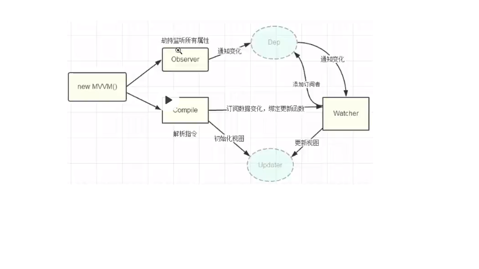

# 模拟vue, 实现了一个最简单的响应式.

# 用法
index.html

```
<body>
  <div id="app">
     <p>{{name}}</p>
     <p i-text="name"></p>
     <p>{{age}}</p>
     <p>
      <span>{{age}}</span>
     </p>
     <input type="text" i-model="name">
     <button @click="changeName">呵呵</button>
     <div i-html="html"></div>
  </div>
</body>
```
app.js
```
import IVue from '../src/ivue';

const vm = new IVue({
  el: '#app',
  data: {
    name: 'jack',
    age: 18,
    html: '<button style="color: red">this is button</button>'
  },
  methods: {
    changeName(){
      this.name = 'tom';
    }
  },
  created(){
    setInterval(() => {
      this.age += 1;
    }, 1000);
  }
});
```
# 支持的功能有:
- 插值: {{name}}
- 指令: i-text, i-html, i-model
- 事件绑定: @click,...

# 项目结构介绍
框架的代码放在src目录下.
1. ivue.js: 初始化变量, 设置data响应, 代理data到vm实例上.
2. dep.js： 依赖管理器. 保存依赖, 通知依赖更新.
3. watcher.js: 
4. compiler.js: 编译节点, 搜集依赖.

# 关系图
